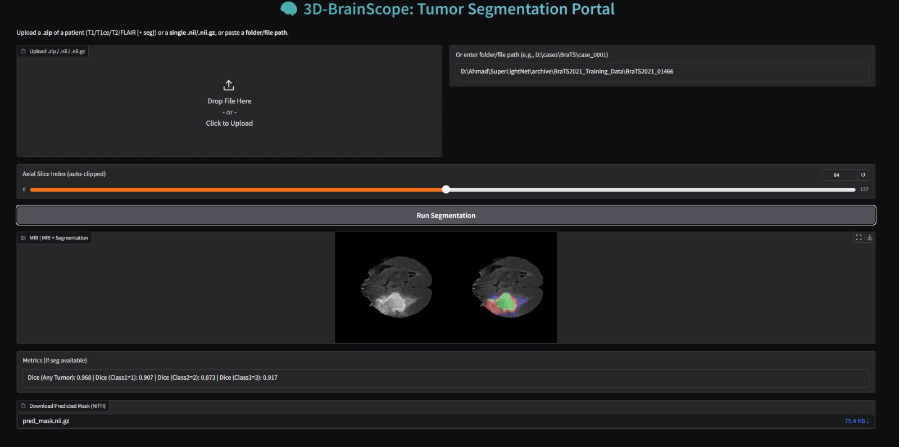
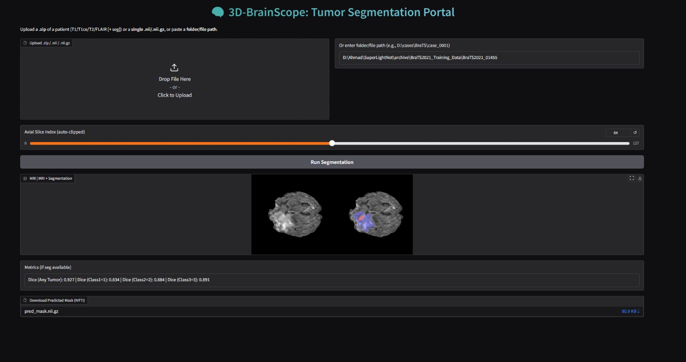

# Lightweight 3D Brain Tumor Segmentation

This project implements a lightweight deep learning framework for multimodal **3D brain tumor segmentation** on the BraTS2021 dataset.  
It focuses on efficient training and inference while preserving segmentation quality.

---

## 🔑 Key Features
- **Lightweight model** implementation in PyTorch.  
- **Patch-based preprocessing** to handle 3D MRI volumes on limited hardware.  
- **Segmentation visualization UI** built with Gradio.  
- Experiments on efficiency, memory footprint, and segmentation accuracy.  

---

## 📂 Project Structure
- `train.py` — Training pipeline.  
- `dataset.py` — Dataset loader and patch extraction.  
- `config.py` — Configurations and hyperparameters.  
- `loss_metrics.py` — Loss functions and evaluation metrics.  
- `project_main.py` — Main entry point for running the project.  
- `app.py` — Gradio UI for visualization.  
- `checkpoints/` — Contains trained model weights (`best.pth`).  

---

## ⚙️ Installation
1. Clone the repository:
   ```bash
   git clone https://github.com/ahmedjawad24/Lightweight-Brain-Tumor-Segmentation.git
   cd Lightweight-Brain-Tumor-Segmentation

Create a virtual environment and install dependencies:

Bash
python -m venv venv
source venv/bin/activate   # (Linux/Mac)
venv\Scripts\activate      # (Windows)

pip install -r requirements.txt

🚀 Usage

Training
python train.py

Run UI for segmentation visualization
python app.py
Open the Gradio link shown in the terminal to interact with the model.

📌 Notes
Dataset is not included in this repository due to size.
Download the BraTS2021 dataset and update dataset paths in config.py.

Pretrained model weight best.pth is provided under checkpoints/.

## Leakage-safe held-out evaluation

Evaluate only patient IDs assigned to `val` or `test` in the patient split
manifest. Inference covers each complete MRI volume with overlapping windows;
omitted modalities are zero-filled rather than sourced from another scan.

```powershell
python scripts/evaluate_patient_split.py `
  --split_json splits/patient_splits.json `
  --split test `
  --checkpoint checkpoints/best.pth `
  --output_csv results/leakage_safe/test_all_best.csv `
  --device cuda `
  --modalities all
```

For a modality subset, use for example `--modalities t1ce,flair`. The evaluator
refuses training splits and existing output files. It writes one patient per CSV
row and a same-named JSON file containing aggregate statistics.

Empty-region policy: if prediction and ground truth are both empty, Dice is 1
and HD95 is 0 mm. If exactly one is empty, Dice is 0 and HD95 is set to the
physical image diagonal, providing a finite worst-case penalty for aggregation.

## Leakage-safe training from scratch

The maintained training pipeline is organized as follows:

- `src/superlightnet/patient_data.py` — manifest-selected patient datasets and patch generation.
- `src/superlightnet/training.py` — isolation assertions, full-volume validation, and checkpoint helpers.
- `scripts/train_patient_split.py` — command-line training entry point.
- `checkpoints/leakage_safe/` — new patient-split checkpoints.
- `results/leakage_safe/` — training logs and held-out evaluation results.

From an Anaconda Prompt with CUDA-enabled PyTorch:

```bat
python scripts\train_patient_split.py --split_json splits\patient_splits.json --train_split train --val_split val --output_dir checkpoints\leakage_safe --epochs 100 --batch_size 1 --lr 0.001 --device cuda --roi_size 160,160,160
```

Resume the same run from its latest completed epoch and prefetch data with four
training workers and two validation workers:

```bat
python scripts\train_patient_split.py --split_json splits\patient_splits.json --train_split train --val_split val --output_dir checkpoints\leakage_safe --epochs 100 --batch_size 1 --lr 0.001 --device cuda --roi_size 160,160,160 --num_workers 4 --val_workers 2 --resume checkpoints\leakage_safe\last_patient_split.pth
```

`training_log.csv` stores per-epoch losses and validation Dice.
`training_batch_log.csv` stores each batch loss from the point at which batch
logging was enabled; batch values printed before that point cannot be recovered.

Training refuses to start if train, validation, and test patient IDs overlap or
if an existing leakage-safe checkpoint/training log would be overwritten. Model
selection uses the mean validation Dice across WT, TC, and ET. Test patients are
reserved exclusively for final evaluation.

🧠 Dataset
BraTS2021 Challenge Dataset

---

## 📷 Results Preview
Here are some example outputs from the segmentation model:

<p align="center">
  
  
</p>


📜 License
This project is open-source and available under the MIT License.
